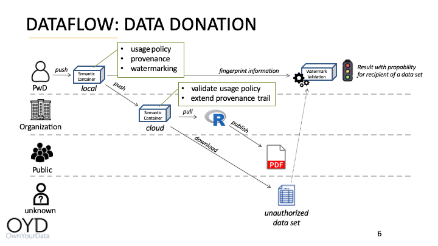

Source URL: https://github.com/sem-con/sc-diabetes/blob/master/dataflows/Data_Donation/README.md

# Dataflow: Data Donation

## Introduction

The Data Donation dataflow demonstrates the following capabilities of Semantic Containers:

* avoding duplicates on data upload    
* providing a Diabetes specific Usage Policy    
* generating a Provenance trail specific to diabetes devices    
* matching Usage Policies specifically based on subsets for Data Categories    
* applying and verifying digital watermarks    

The figure below depicts a graphical representation of the Data Donation dataflow.

<kbd></kbd>

## Stakeholders
The following stakeholders are part of the dataflow:

* **PwD** (Person with Diabetes) provides diabetes data in format described in the [Tidepool Integration dataflow](https://github.com/sem-con/sc-diabetes/tree/master/dataflows/Tidepool_Integration#stakeholders)    

* **Organization** an organization that receives a diabetes data donation from a PwD    

* **Public** general public having access to a report published by the organization    

* **unknown** person with an unauthorized data set    

## Components    
The following components are part of the dataflow:    

* **Local Semantic Container of PwD** receives data from PwD and is entrypoint for this dataflow      
    *configuration:* [df1_pwd_local_init.trig](df1_pwd_local_init.trig)     
    *Usage Policy:* Data Category is "Insulin Pump", no other restrictions    
    *note:* the hierarchy in Data Category in this example is:
    * Health Data    
        * Diabetes    
            * Insulin Pump    
            * Sensor    

* **Cloud Semantic Container of Organization**    
    *configuration:* [df1_org_cloud_init.trig](df1_org_cloud_init.trig)     
    *Usage Policy:* Data Category is "Diabetes", no other restrictions

* **R-Notebook** processing data from Cloud Semantic Container of Organization - [available here](R_Notebook.Rmd)    
    alternatively also available as [Jupyter Notebook](Jupyter_Notebook.ipynb)

## High-level Steps and Capability Demonstration

1. **PwD uploads data**    
    A local Semantic Container stores diabetes data of the PwD and the following datasets are used as an example:    
    * [df1_data_part1.json](df1_data_part1.json) with 2.432 records from 2015-12-02 to 2015-12-13    
    * [df1_data_part2.json](df1_data_part2.json) with 1.596 records from 2015-12-13 to 2015-12-18    

    The following capabilities are demonstrated in this step:    
    * duplicates within a dataset and between datasets are identified and only first occurence is stored in the Semantic Container    
    * the Usage Policy was extended with a diabetes specific hierarchy of data categories    
    * the Provenance information holds additional data (Entity, Activity, and Agent) from the insulin monitoring device    

2. **PwD shares data with Organization**    
    Another Semantic Container represents the data store of an organization. The PwD donates the data stored in the local Semantic Container by pushing the data to the container of the organization. The following capabilities are demonstrated in this step:    
    * unique digital watermarking is applied to the data when sent to the organization
    * Usage Policies between PwD (Data Subject) and Organization (Data Controller) are matched; the Data Controller is required to have a Usage Policy that is equal or a subset of the Usage Policy from the PwD - except for the Data Categorie where the Data Controller only excepts equal or hierarchically subordinate Data Categories    
    * the Provenance information is appended with the information from upload process and the Semantic Container information from the organization

3. **Organization processes PwD data and leaks an unauthorized copy**    
    The following capabilities are demonstrated in this step:    
    * accessing data in a Semantic Container from an R-Notebook
    * accessing data in a Semantic Container from a Jupyter-Notebook

4. **PwD identifies Organization from unauthorized copy**    
    The following capabilities are demonstrated in this step:    
    * identify the relevant fragment from a suspicious dataset   
        *note: a Semantic Container partitions data into fragments for applying digital watermarks; for diabetes data a fragment is all data for a specific day*
    * identify the account from a suspicious fragment

## Detailed Commandline Walk-through    
This section provides example commands to demonstrate the functionality described above.

1. **PwD uploads data**    
    a) start local Semantic Container for PwD (*docker name: df1_pwd_local, port: 4000*)    

        SC_IMAGE=semcon/sc-diabetes:latest; \
        docker run -d --name df1_pwd_local -p 4000:3000 \
            -e IMAGE_SHA256="$(docker image ls --no-trunc -q $SC_IMAGE | cut -c8-)" \
            -e IMAGE_NAME=$SC_IMAGE -e WATERMARK=true \
            $SC_IMAGE /bin/init.sh "$(< df1_pwd_local_init.trig)"

    b) get credentials and store in `PWD_TOKEN_LOCAL`    

        APP_KEY=`docker logs df1_pwd_local 2>/dev/null | grep ^APP_KEY | awk -F " " '{print $NF}'`; \
        APP_SECRET=`docker logs df1_pwd_local 2>/dev/null | grep ^APP_SECRET | awk -F " " '{print $NF}'`; \
        export PWD_TOKEN_LOCAL=`curl -X POST -s -d grant_type=client_credentials \
            -d client_id=$APP_KEY -d client_secret=$APP_SECRET -d scope=admin \
            http://localhost:4000/oauth/token | jq -r '.access_token'`

    c) write diabetes data into Semantic Container    

        # first dataset with data from 2015-12-02 to 2015-12-13
        cat df1_data_part1.json | \
            curl -X POST -d @- \
                -H "Content-Type: application/json" \
                -H "Authorization: Bearer $PWD_TOKEN_LOCAL" \
                http://localhost:4000/api/data

        # second dataset with data from 2015-12-13 to 2015-12-18
        cat df1_data_part2.json | \
            curl -X POST -d @- \
                -H "Content-Type: application/json" \
                -H "Authorization: Bearer $PWD_TOKEN_LOCAL" \
                http://localhost:4000/api/data

    d) retrieve information from local Semantic Container of PwD    

        # number of records: 3820
        curl -s -H "Content-Type: application/json" -H "Authorization: Bearer $PWD_TOKEN_LOCAL" \
            http://localhost:4000/api/data/plain | jq -r '. | length'

        # show provenance information
        curl -s -H "Content-Type: application/json" -H "Authorization: Bearer $PWD_TOKEN_LOCAL" \
            http://localhost:4000/api/data | \
            jq '.provision.provenance' | \
            ruby -e "puts $(</dev/stdin)"

2. **PwD shares data with Organization**    
    a) create a read-only account for Organization in the local container    

        TMP=`curl -s -d name=org -d scopes=read \
            -H "Authorization: Bearer $PWD_TOKEN_LOCAL" \
            http://localhost:4000/oauth/applications`; \
        TMP_KEY=`echo $TMP | jq -r '.client_id'`; \
        TMP_SECRET=`echo $TMP | jq -r '.client_secret'`; \
        export ORG_TOKEN_LOCAL=`curl -X POST -s -d grant_type=client_credentials \
            -d client_id=$TMP_KEY -d client_secret=$TMP_SECRET -d scope=read \
            http://localhost:4000/oauth/token | jq -r '.access_token'`

    b) start cloud Semantic Container for Organization (*docker name: df1_org1_cloud, port: 4500*)    

        SC_IMAGE=semcon/sc-diabetes:latest; \
        docker run -d --name df1_org1_cloud -p 4500:3000 \
            -e IMAGE_SHA256="$(docker image ls --no-trunc -q $SC_IMAGE | cut -c8-)" \
            -e IMAGE_NAME=$SC_IMAGE -e AUTH=true \
            $SC_IMAGE /bin/init.sh "$(< df1_org1_cloud_init.trig)"

    c) get credentials and store in `ORG_TOKEN_CLOUD`    

        APP_KEY=`docker logs df1_org1_cloud 2>/dev/null | grep ^APP_KEY | awk -F " " '{print $NF}'`; \
        APP_SECRET=`docker logs df1_org1_cloud 2>/dev/null | grep ^APP_SECRET | awk -F " " '{print $NF}'`; \
        export ORG_TOKEN_CLOUD=`curl -X POST -s -d grant_type=client_credentials \
            -d client_id=$APP_KEY -d client_secret=$APP_SECRET -d scope=admin \
            http://localhost:4500/oauth/token | jq -r '.access_token'`

    d) PwD pushes data to Organization

        curl -s -H "Authorization: Bearer $ORG_TOKEN_LOCAL" http://localhost:4000/api/data | \
            curl -X POST -d @- \
                -H "Content-Type: application/json" \
                -H "Authorization: Bearer $ORG_TOKEN_CLOUD" \
                http://localhost:4500/api/data

    e) retrieve information from cloud Semantic Container of Organization    

        # number of records: 3820
        curl -s -H "Content-Type: application/json" -H "Authorization: Bearer $ORG_TOKEN_CLOUD" \
            http://localhost:4500/api/data/plain | jq -r '. | length'

        # show provenance information
        curl -s -H "Content-Type: application/json" -H "Authorization: Bearer $ORG_TOKEN_CLOUD" \
            http://localhost:4500/api/data | \
            jq '.provision.provenance' | \
            ruby -e "puts $(</dev/stdin)"

    f) compare original data and watermarked data    

        # first record of original data
        jq '.[0]' df1_data_part1.json 

        # first record of data from Organization
        curl -s -H "Content-Type: application/json" -H "Authorization: Bearer $ORG_TOKEN_CLOUD" \
            http://localhost:4500/api/data/plain | jq -r '.[0]'

3. **Organization processes PwD data and leaks a unauthorized copy**  
    a) retrieve OAuth credentials to access data    

        docker logs df1_org1_cloud 2>/dev/null | grep ^APP_KEY | awk -F " " '{print "APP-KEY: "$NF}'
        docker logs df1_org1_cloud 2>/dev/null | grep ^APP_SECRET | awk -F " " '{print "APP-SECRET: "$NF}'

    b) open [R Notebook](R_Notebook.Rmd) / [Jupyter Notebook](Jupyter_Notebook.ipynb) and paste credential information

        # in R
        key <- '{paste APP-KEY here}' 
        secret <- '{paste APP-SECRET here}'

        # in Python
        key = "{paste APP_KEY here}"
        secret = "{paste APP_KEY here}"

    c) leak unauthorized copy

        curl -s -H "Authorization: Bearer $ORG_TOKEN_CLOUD" -H "Content-Type: application/json" \
            http://localhost:4500/api/data/plain > unauthorized_copy.json

4. **PwD identifies Organization from unauthorized copy**    
    a) identify fragment from suspicious dataset    
        *The command returns an array with information on all fragments in the Semantic Container. The fragments are sorted by distance to the original in ascending order. The first item in the array has the highest probability as a matching fragment.*

        cat unauthorized_copy.json | \
            curl -X POST -d @- \
                -H "Content-Type: application/json" \
                -H "Authorization: Bearer $PWD_TOKEN_LOCAL" \
                http://localhost:4000/api/watermark/identify

    b) identify account from suspicious fragment    
        *The command returns an array with information on all accounts for the selected fragment in the Semantic Container. The entries are sorted by distance in ascending order. The first item in the array has the highes probability for a match - distance: 0.0 is an exact match.*    

        # use jq to extract a specific fragment from a suspicious dataset
        # in the current example the data set from 2015-12-02 has only 7 records
        jq '.[0:7]' unauthorized_copy.json > fragment.json

        cat fragment.json |  \
            curl -X POST -d @- \
                -H "Content-Type: application/json" \
                -H "Authorization: Bearer $PWD_TOKEN_LOCAL" \
                http://localhost:4000/api/watermark/account/0/fragment/2015-12-02

