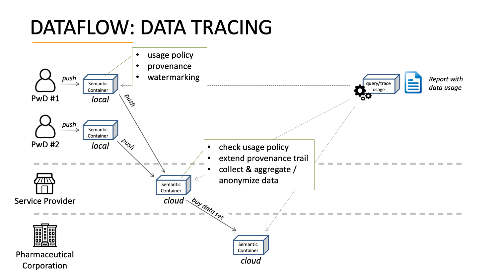
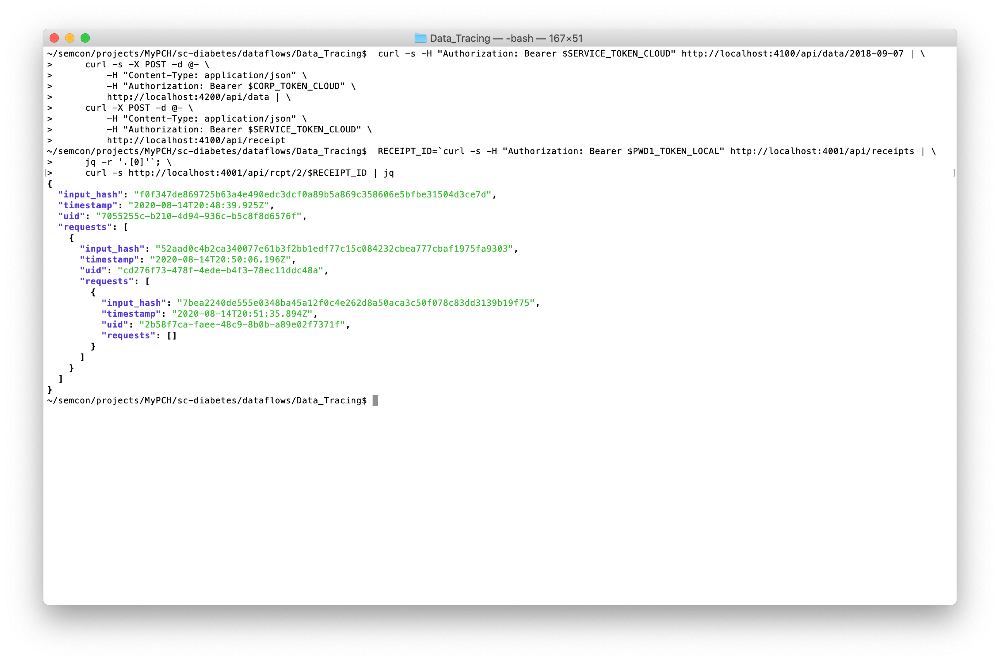

Source URL: https://github.com/sem-con/sc-diabetes/blob/master/dataflows/Data_Tracing/README.md    

# Dataflow: Data Tracing

## Introduction

The Data Tracing dataflow demonstrates the following capabilities:

* 2 PwDs upload their local diabetes data to an aggregation/anonymization service    
* aggregating/anonymizing data in a Semantic Container
* a service provider transfers selected (aggregated) data to a 3rd party    
* each PwD traces his/her own data and compiles a usage report    

The figure below depicts a graphical representation of the Data Tracing dataflow.

<kbd></kbd>

## Stakeholders
The following stakeholders are part of the dataflow:

* **PwD #1 & #2** (Persons with Diabetes) provide diabetes data in a format described in the [Tidepool Integration dataflow](https://github.com/sem-con/sc-diabetes/tree/master/dataflows/Tidepool_Integration#stakeholders)    

* **Service Provider** receives diabetes data from various PwDs and aggregates/anonymizes the data    

* **Research Institute** buys a subset of the aggregated data (result data set) provided by the Service Provider    


## Components    
The following components are part of the dataflow:    

* **Local Semantic Container of PwD #1** receives data from PwD and is entrypoint for this dataflow      
    *configuration:* [df3_pwd1_local_init.trig](df3_pwd1_local_init.trig)     
   
* **Local Semantic Container of PwD #2** receives data from PwD and is entrypoint for this dataflow      
    *configuration:* [df3_pwd2_local_init.trig](df3_pwd2_local_init.trig)     
   
* **Cloud Semantic Container of Service Provider**    
    *configuration:* [df3_service_cloud_init.trig](df3_service_cloud_init.trig)     

* **Cloud Semantic Container of Reserach Institute**    
    *configuration:* [df3_corp_cloud_init.trig](df3_corp_cloud_init.trig)     


## High-level Steps and Capability Demonstration

1. **PwDs uploads data**    
    A local Semantic Container stores diabetes data of PwD #1 and the following dataset is used as an example:    
    * [df3_data1.json](df3_data1.json) with 4.031 records from 2018-09-07 to 2018-09-21    

    A local Semantic Container stores diabetes data of PwD #2 and the following dataset is used as an example:    
    * [df3_data2.json](df3_data2.json) with 4.031 recors from 2018-09-07 to 2018-09-21    

    The following capabilities are demonstrated in this step:    
    * 2 PwD upload their local diabetes data to an aggregation/anonymization service    

2. **Service Provider aggregates/anonymizes data**    
    A cloud Semantic Container accepts data from registered PwDs and performs an aggregation/anonymization endpoint together with filtering.

    The following capabilities are demonstrated in this step:    
    * aggregating/anonymizing data in a Semantic Container

3. **Research Institute acquires data set**    
    A subset of the aggregated data is tranferred to a Semantic Container of the Research Institute.

    The following capabilities are demonstrated in this step:    
    * a service provider transfers selected (aggregated) data to a 3rd party

4. **PwD traces data along processing pipeline**
    PwDs use information in Semantic Containers to trace the data flow from the local container towards the cloud container of the Research Institute.

    The following capabilities are demonstrated in this step:    
    * each PwD traces his/her own data and compiles a usage report


## Detailed Commandline Walk-through    
This section provides example commands to demonstrate the functionality described above.

1. **PwDs upload data**    
    a) start local Semantic Container for PwD #1 (*docker name: df3_pwd1_local, port: 4001*)    

        SC_IMAGE=semcon/sc-diabetes:latest; \
        docker run -d --name df3_pwd1_local -p 4001:3000 \
            -e IMAGE_SHA256="$(docker image ls --no-trunc -q $SC_IMAGE | cut -c8-)" \
            -e IMAGE_NAME=$SC_IMAGE -e AUTH=true \
            -e SERVICE_ENDPOINT="http://10.0.0.6:4001" \
            $SC_IMAGE /bin/init.sh "$(< df3_pwd1_local_init.trig)"

    b) get credentials and store in `PWD1_TOKEN_LOCAL`    

        APP_KEY=`docker logs df3_pwd1_local 2>/dev/null | grep ^APP_KEY | awk -F " " '{print $NF}'`; \
        APP_SECRET=`docker logs df3_pwd1_local 2>/dev/null | grep ^APP_SECRET | awk -F " " '{print $NF}'`; \
        export PWD1_TOKEN_LOCAL=`curl -X POST -s -d grant_type=client_credentials \
            -d client_id=$APP_KEY -d client_secret=$APP_SECRET -d scope=admin \
            http://localhost:4001/oauth/token | jq -r '.access_token'`

    c) write diabetes data into Semantic Container    

        # dataset Katie_in_control with data from 2018-09-07 to 2018-09-21
        cat df3_data1.json | \
            curl -X POST -d @- \
                -H "Content-Type: application/json" \
                -H "Authorization: Bearer $PWD1_TOKEN_LOCAL" \
                http://localhost:4001/api/data

    d) start local Semantic Container for PwD #2 (*docker name: df3_pwd2_local, port: 4002*)    

        SC_IMAGE=semcon/sc-diabetes:latest; \
        docker run -d --name df3_pwd2_local -p 4002:3000 \
            -e IMAGE_SHA256="$(docker image ls --no-trunc -q $SC_IMAGE | cut -c8-)" \
            -e IMAGE_NAME=$SC_IMAGE -e AUTH=true \
            -e SERVICE_ENDPOINT="http://10.0.0.6:4002" \
            $SC_IMAGE /bin/init.sh "$(< df3_pwd2_local_init.trig)"

    e) get credentials and store in `PWD2_TOKEN_LOCAL`    

        APP_KEY=`docker logs df3_pwd2_local 2>/dev/null | grep ^APP_KEY | awk -F " " '{print $NF}'`; \
        APP_SECRET=`docker logs df3_pwd2_local 2>/dev/null | grep ^APP_SECRET | awk -F " " '{print $NF}'`; \
        export PWD2_TOKEN_LOCAL=`curl -X POST -s -d grant_type=client_credentials \
            -d client_id=$APP_KEY -d client_secret=$APP_SECRET -d scope=admin \
            http://localhost:4002/oauth/token | jq -r '.access_token'`

    f) write diabetes data into Semantic Container    

        # adapted dataset Katie_poor_control with data from 2018-09-07 to 2018-09-21
        cat df3_data2.json | \
            curl -X POST -d @- \
                -H "Content-Type: application/json" \
                -H "Authorization: Bearer $PWD2_TOKEN_LOCAL" \
                http://localhost:4002/api/data

2. **Service Provider aggregates/anonymizes data**    
    a) start cloud Semantic Container for Service Provider (*docker name: df3_service_cloud, port: 4100*)    

        SC_IMAGE=semcon/sc-diabetes_service_provider:latest; \
        docker run -d --name df3_service_cloud -p 4100:3000 \
            -e IMAGE_SHA256="$(docker image ls --no-trunc -q $SC_IMAGE | cut -c8-)" \
            -e IMAGE_NAME=$SC_IMAGE -e AUTH=true \
            -e SERVICE_ENDPOINT="http://10.0.0.6:4100" \
            $SC_IMAGE /bin/init.sh "$(< df3_service_cloud_init.trig)"

    b) get credentials and store in `SERVICE_TOKEN_CLOUD`    

        APP_KEY=`docker logs df3_service_cloud 2>/dev/null | grep ^APP_KEY | awk -F " " '{print $NF}'`; \
        APP_SECRET=`docker logs df3_service_cloud 2>/dev/null | grep ^APP_SECRET | awk -F " " '{print $NF}'`; \
        export SERVICE_TOKEN_CLOUD=`curl -X POST -s -d grant_type=client_credentials \
            -d client_id=$APP_KEY -d client_secret=$APP_SECRET -d scope=admin \
            http://localhost:4100/oauth/token | jq -r '.access_token'`

    c) create individual accounts for each PwD for writing    

        # PwD #1 write access
        TMP=`curl -s -d name=pwd1 -d scopes=write \
            -H "Authorization: Bearer $SERVICE_TOKEN_CLOUD" \
            http://localhost:4100/oauth/applications`; \
        TMP_KEY=`echo $TMP | jq -r '.client_id'`; \
        TMP_SECRET=`echo $TMP | jq -r '.client_secret'`; \
        export PWD1_TOKEN_SERVICE_PROVIDER=`curl -X POST -s -d grant_type=client_credentials \
            -d client_id=$TMP_KEY -d client_secret=$TMP_SECRET -d scope=write \
            http://localhost:4100/oauth/token | jq -r '.access_token'`

        # PwD #2 write access
        TMP=`curl -s -d name=pwd2 -d scopes=write \
            -H "Authorization: Bearer $SERVICE_TOKEN_CLOUD" \
            http://localhost:4100/oauth/applications`; \
        TMP_KEY=`echo $TMP | jq -r '.client_id'`; \
        TMP_SECRET=`echo $TMP | jq -r '.client_secret'`; \
        export PWD2_TOKEN_SERVICE_PROVIDER=`curl -X POST -s -d grant_type=client_credentials \
            -d client_id=$TMP_KEY -d client_secret=$TMP_SECRET -d scope=write \
            http://localhost:4100/oauth/token | jq -r '.access_token'`

    d) PwDs push data to Service Provider

        # PwD #1 transfers data
        curl -s -H "Authorization: Bearer $PWD1_TOKEN_LOCAL" http://localhost:4001/api/data | \
            curl -s -X POST -d @- \
                -H "Content-Type: application/json" \
                -H "Authorization: Bearer $PWD1_TOKEN_SERVICE_PROVIDER" \
                http://localhost:4100/api/data | \
            curl -X POST -d @- \
                -H "Content-Type: application/json" \
                -H "Authorization: Bearer $PWD1_TOKEN_LOCAL" \
                http://localhost:4001/api/receipt

        # PwD #2 transfers data
        curl -s -H "Authorization: Bearer $PWD2_TOKEN_LOCAL" http://localhost:4002/api/data | \
            curl -s -X POST -d @- \
                -H "Content-Type: application/json" \
                -H "Authorization: Bearer $PWD2_TOKEN_SERVICE_PROVIDER" \
                http://localhost:4100/api/data | \
            curl -X POST -d @- \
                -H "Content-Type: application/json" \
                -H "Authorization: Bearer $PWD2_TOKEN_LOCAL" \
                http://localhost:4002/api/receipt

    e) retrieve aggregated data from Service Provider    
        in this scenario only data *in range* (8 < cgm-value < 12) is used in the aggregated result    

        # number of records: 4.031
        curl -s -H "Content-Type: application/json" -H "Authorization: Bearer $SERVICE_TOKEN_CLOUD" \
            http://localhost:4100/api/data/plain | jq -r '. | length'

3. **Research Institute acquires data set**    
    a) start cloud Semantic Container for Research Institute (*docker name: df3_corp_cloud, port: 4200*)    

        SC_IMAGE=semcon/sc-diabetes:latest; \
        docker run -d --name df3_corp_cloud -p 4200:3000 \
            -e IMAGE_SHA256="$(docker image ls --no-trunc -q $SC_IMAGE | cut -c8-)" \
            -e IMAGE_NAME=$SC_IMAGE -e AUTH=true \
            -e SERVICE_ENDPOINT="http://10.0.0.6:4200" \
            $SC_IMAGE /bin/init.sh "$(< df3_corp_cloud_init.trig)"

    b) get credentials and store in `CORP_TOKEN_CLOUD`    

        APP_KEY=`docker logs df3_corp_cloud 2>/dev/null | grep ^APP_KEY | awk -F " " '{print $NF}'`; \
        APP_SECRET=`docker logs df3_corp_cloud 2>/dev/null | grep ^APP_SECRET | awk -F " " '{print $NF}'`; \
        export CORP_TOKEN_CLOUD=`curl -X POST -s -d grant_type=client_credentials \
            -d client_id=$APP_KEY -d client_secret=$APP_SECRET -d scope=admin \
            http://localhost:4200/oauth/token | jq -r '.access_token'`


    c) Service Provider pushes data to Research Institute    
        in this examples it is a single day (2018-09-07) that includes only data from PwD #1

        curl -s -H "Authorization: Bearer $SERVICE_TOKEN_CLOUD" http://localhost:4100/api/data/2018-09-07 | \
            curl -s -X POST -d @- \
                -H "Content-Type: application/json" \
                -H "Authorization: Bearer $CORP_TOKEN_CLOUD" \
                http://localhost:4200/api/data | \
            curl -X POST -d @- \
                -H "Content-Type: application/json" \
                -H "Authorization: Bearer $SERVICE_TOKEN_CLOUD" \
                http://localhost:4100/api/receipt

4. **PwD traces data along processing pipeline**    
    a) trace data processing for PwD #1

        RECEIPT_ID=`curl -s -H "Authorization: Bearer $PWD1_TOKEN_LOCAL" http://localhost:4001/api/receipts | \
            jq -r '.[0]'`; \
            curl -s http://localhost:4001/api/rcpt/2/$RECEIPT_ID | jq

    **Result:** the subsequent access requests from local container (uid: `b9bf5926-4ce4-4568-b479-dcf2a4b917fa`) to Serivce Prover (uid :`e5058d89-8744-4c61-ab70-aaa4749d24a5`) to Research Institute (uid: `658e0758-9638-4b07-9553-e4cf65c1e9df`) are shown in the usage report.
    
    The figure below shows an example of the Data Tracing input and output in the command-line.

     <kbd></kbd>

    *Hint:* use the API endpoint `curl -s http://HOST:PORT/api/receipt/:RECEIPT_HASH` (i.e., `receipt` instead of `rcpt`) to also show individual IDs of the records transferred; for an overview the abreviated version is used here

    ```json
    {
      "input_hash": "f0f347de869725b63a4e490edc3dcf0a89b5a869c358606e5bfbe31504d3ce7d",
      "timestamp": "2020-05-22T16:22:22.446Z",
      "uid": "b9bf5926-4ce4-4568-b479-dcf2a4b917fa",
      "requests": [
        {
          "input_hash": "9465717f8a59d0d2f734f905f8e7a765cfda626591019d301cc0f4b1f370d06c",
          "timestamp": "2020-05-22T16:23:40.843Z",
          "uid": "e5058d89-8744-4c61-ab70-aaa4749d24a5",
          "requests": [
            {
              "input_hash": "b26bdc37c380848863e04902a339e21e4265ce7c3699456c1ff53dd41680b60e",
              "timestamp": "2020-05-22T16:24:47.598Z",
              "uid": "658e0758-9638-4b07-9553-e4cf65c1e9df",
              "requests": []
            }
          ]
        }
      ]
    }
    ```


    b) trace data processing for PwD #2

        RECEIPT_ID=`curl -s -H "Authorization: Bearer $PWD2_TOKEN_LOCAL" http://localhost:4002/api/receipts | \
            jq -r '.[0]'`; \
            curl -s http://localhost:4002/api/rcpt/2/$RECEIPT_ID | jq


    **Result:** since data from PwD #2 was not used in the aggregation for the query from the Research Institute (day=2018-09-07) the tracing shows only data in the local container (uid: `a`) and transfer to the Service Provider (uid: `e5058d89-8744-4c61-ab70-aaa4749d24a5`)    

    ```json
    {
      "input_hash": "484b430a19a5a88ad216b3e912d3d1b49a5c58d5b700e913679676301f96df4c",
      "timestamp": "2020-05-22T16:22:55.914Z",
      "uid": "c74a9fc2-6b4c-4037-bcd6-4ac1b4799948",
      "requests": [
        {
          "input_hash": "08137013fc38b51cc8eba3a14c6d2f6a75d6c1c9cedbf87eef81851fd55a4e4a",
          "timestamp": "2020-05-22T16:23:53.554Z",
          "uid": "e5058d89-8744-4c61-ab70-aaa4749d24a5",
          "requests": []
        }
      ]
    }    
    ```

    c) transfer additional data (`day=2018-09-08`, i.e., a dataset that includes both PwDs) from Service Provider to Research Institute    

        curl -s -H "Authorization: Bearer $SERVICE_TOKEN_CLOUD" http://localhost:4100/api/data/2018-09-08 | \
            curl -s -X POST -d @- \
                -H "Content-Type: application/json" \
                -H "Authorization: Bearer $CORP_TOKEN_CLOUD" \
                http://localhost:4200/api/data | \
            curl -X POST -d @- \
                -H "Content-Type: application/json" \
                -H "Authorization: Bearer $SERVICE_TOKEN_CLOUD" \
                http://localhost:4100/api/receipt

    **Result PwD #1**: an additional entry tranferred from Service Provider to Research Institute    

        RECEIPT_ID=`curl -s -H "Authorization: Bearer $PWD1_TOKEN_LOCAL" http://localhost:4001/api/receipts | \
            jq -r '.[0]'`; \
            curl -s http://localhost:4001/api/rcpt/2/$RECEIPT_ID | jq

    ```json
    {
      "input_hash": "f0f347de869725b63a4e490edc3dcf0a89b5a869c358606e5bfbe31504d3ce7d",
      "timestamp": "2020-05-22T16:22:22.446Z",
      "uid": "b9bf5926-4ce4-4568-b479-dcf2a4b917fa",
      "requests": [
        {
          "input_hash": "9465717f8a59d0d2f734f905f8e7a765cfda626591019d301cc0f4b1f370d06c",
          "timestamp": "2020-05-22T16:23:40.843Z",
          "uid": "e5058d89-8744-4c61-ab70-aaa4749d24a5",
          "requests": [
            {
              "input_hash": "b26bdc37c380848863e04902a339e21e4265ce7c3699456c1ff53dd41680b60e",
              "timestamp": "2020-05-22T16:24:47.598Z",
              "uid": "658e0758-9638-4b07-9553-e4cf65c1e9df",
              "requests": []
            },
            {
              "input_hash": "8efb43447a45461385bd22bb6131fccd2cd5c2c91a591a2133ad33235c4cc1ba",
              "timestamp": "2020-05-23T10:47:53.813Z",
              "uid": "658e0758-9638-4b07-9553-e4cf65c1e9df",
              "requests": []
            }
          ]
        }
      ]
    }
    ```


    **Result PwD #2**: data now also tranferred from Service Provider to Research Institute    

        RECEIPT_ID=`curl -s -H "Authorization: Bearer $PWD2_TOKEN_LOCAL" http://localhost:4002/api/receipts | \
            jq -r '.[0]'`; \
            curl -s http://localhost:4002/api/rcpt/2/$RECEIPT_ID | jq

    ```json
    {
      "input_hash": "484b430a19a5a88ad216b3e912d3d1b49a5c58d5b700e913679676301f96df4c",
      "timestamp": "2020-05-22T16:22:55.914Z",
      "uid": "c74a9fc2-6b4c-4037-bcd6-4ac1b4799948",
      "requests": [
        {
          "input_hash": "08137013fc38b51cc8eba3a14c6d2f6a75d6c1c9cedbf87eef81851fd55a4e4a",
          "timestamp": "2020-05-22T16:23:53.554Z",
          "uid": "e5058d89-8744-4c61-ab70-aaa4749d24a5",
          "requests": [
            {
              "input_hash": "8efb43447a45461385bd22bb6131fccd2cd5c2c91a591a2133ad33235c4cc1ba",
              "timestamp": "2020-05-23T10:47:53.813Z",
              "uid": "658e0758-9638-4b07-9553-e4cf65c1e9df",
              "requests": []
            }
          ]
        }
      ]
    }
    ```
