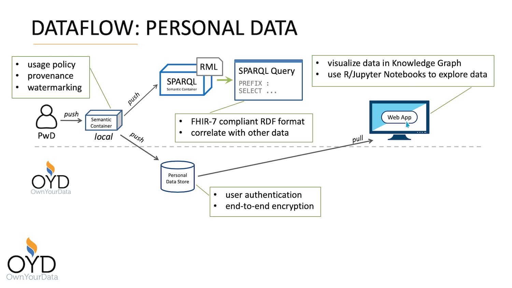
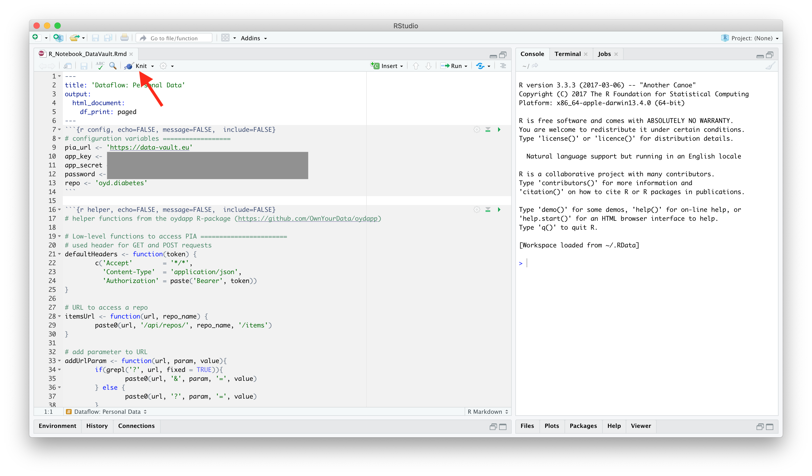

Source URL: https://github.com/sem-con/sc-diabetes/blob/master/dataflows/Personal_Data/README.md

# Dataflow: Personal Data

## Introduction

The Personal Data dataflow demonstrates the following capabilities of Semantic Containers:

* converting diabetes data into [FHIR](https://www.hl7.org/fhir/)-compliant RDF format    
* accessing data through a SPARQL endpoint     
* uploading data to the OwnYourData Data Vault    
* strong encryption of diabetes data    
* authentication methods for diabetes data
* visualizing data in a Knowledge Graph    
* gain insights from personal data through individual analysis    
* access and process diabetes data with standard tools

The figure below depicts a graphical representation of the Personal Data dataflow.

<kbd></kbd>

## Stakeholders
The following stakeholders are part of the dataflow:

* **PwD** (Person with Diabetes) provides diabetes data in format described in the [Tidepool Integration dataflow](https://github.com/sem-con/sc-diabetes/tree/master/dataflows/Tidepool_Integration#stakeholders)    
* **OwnYourData** is a Personal Data Store provider: [OwnYourData Data Vault](https://data-vault.eu/en) (alternatives: [Personium](https://personium.io/en/index.html), [Freezr](http://www.freezr.info/))    

## Components    
The following components are part of the dataflow:    

* **Local Semantic Container of PwD** receives data from PwD and is entrypoint for this dataflow      
    *configuration:* [df2_pwd_local_init.trig](df2_pwd_local_init.trig)     
   
* **SPARQL Semantic Container** receives data from local container, applies RML mapping to act as SPARQL endpoint, and executes SPARQL queries      
    *configuration:* [df2_pwd_local_sparql_init.trig](df2_pwd_local_sparql_init.trig)     
    *Example SPARQL queries:* [query1.sparql](query1.sparql), [query2.sparql](query2.sparql)

* **Personal Data Store** provides permanent and secure storage for diabetes data    
    *Diabetes Plugin Manifest:* [diabetes_en.json](diabetes_en.json)     

* **Web App** independent analysis of personal diabetes data stored in the Data Vault      
    *R-Notebook:* [R_Notebook_DataVault.Rmd](R_Notebook_DataVault.Rmd)    
    *Jupyter-Notebook:* [Jupyter_Notebook-DataVault.ipynb](Jupyter_Notebook-DataVault.ipynb)    

## High-level Steps and Capability Demonstration

1. **PwD uploads data**    
    A local Semantic Container stores diabetes data of the PwD and the following dataset is used as an example:    
    * [df2_data.json](df2_data.json) with 4.031 records from 2018-09-07 to 2018-09-20    

    see the [Data Donation dataflow](https://github.com/sem-con/sc-diabetes/tree/master/dataflows/Data_Donation#high-level-steps-and-capability-demonstration) for documentation and capability demonstration in this step    

2. **SPARQL Endpoint for diabetes data**    
    A [Semantic Container with SPARQL capabilities](https://github.com/sem-con/sc-sparql) accepts data from the local container and applies an [RML mapping](https://rml.io/specs/rml/) to transform the input JSON into an FHIR compliant RDF format that can be queried through [SPARQL](https://en.wikipedia.org/wiki/SPARQL). This allows linking public available health information with private data. The following capabilities are demonstrated in this step:     
    * converting diabetes data into [FHIR](https://www.hl7.org/fhir/)-compliant RDF format    
    * accessing data through a SPARQL endpoint     

3. **Permanent and secure storage for personal diabetes data**    
    The PwD can trigger a data upload from the local container into the OwnYourData Data Vault. This requires an account in the Data Vault and installing the Diabetes Plugin. Uploaded data is visualized in the Knowledge Graph as depicted below:         

    

    The following capabilities are demonstrated in this step:     
    * uploading data to the OwnYourData Data Vault    
    * strong encryption of diabetes data    
    * authentication methods for diabetes data
    * visualizing data in a Knowledge Graph    

    *Note: a free account for the OwnYourData Data Vault can be created here: https://data-vault.eu/en/new - alternatively it can also be operated locally as described here: https://www.ownyourdata.eu/en/developer/ section: Deployment Scenarios > Private Installation; the software is available as Open Source under the MIT License*

4. **Analysis through R & Jupyter Notebooks**    
    The diabetes data stored in the Data Vault can be access by providing the credentials from the Diabetes Plugin and decrypting the recordsets. Examples are available here for download as [R-Notebook](R_Notebook_DataVault.Rmd) and [Jupyter Notebook](Jupyter_Notebook-DataVault.ipynb).    

    The following capabilities are demonstrated in this step:    
    * gain insights from personal data through individual analysis    
    * access and process diabetes data with standard tools

The figure below shows RStudio with the R-Notebook.

<kbd></kbd>

R Markdown Notebook for demonstrating the access to the OwnYourData Data Vault.

<kbd></kbd>

## Detailed Commandline Walk-through    
This section provides example commands to demonstrate the functionality described above.

1. **PwD uploads data**    
    a) start local Semantic Container for PwD (*docker name: df2_pwd_local, port: 4000*)    

        SC_IMAGE=semcon/sc-diabetes:latest; \
        docker run -d --name df2_pwd_local -p 4000:3000 \
            -e IMAGE_SHA256="$(docker image ls --no-trunc -q $SC_IMAGE | cut -c8-)" \
            -e IMAGE_NAME=$SC_IMAGE \
            -e WATERMARK=true \
            $SC_IMAGE /bin/init.sh "$(< df2_pwd_local_init.trig)"

    b) get credentials and store in `PWD_TOKEN_LOCAL`    

        APP_KEY=`docker logs df2_pwd_local 2>/dev/null | grep ^APP_KEY | awk -F " " '{print $NF}'`; \
        APP_SECRET=`docker logs df2_pwd_local 2>/dev/null | grep ^APP_SECRET | awk -F " " '{print $NF}'`; \
        export PWD_TOKEN_LOCAL=`curl -X POST -s -d grant_type=client_credentials \
            -d client_id=$APP_KEY -d client_secret=$APP_SECRET -d scope=admin \
            http://localhost:4000/oauth/token | jq -r '.access_token'`

    c) write diabetes data into Semantic Container    

        # dataset with data from 2018-09-07 to 2018-09-20
        cat df2_data.json | \
            curl -X POST -d @- \
                -H "Content-Type: application/json" \
                -H "Authorization: Bearer $PWD_TOKEN_LOCAL" \
                http://localhost:4000/api/data

    d) retrieve information from local Semantic Container of PwD    

        # number of records: 4031
        curl -s -H "Content-Type: application/json" -H "Authorization: Bearer $PWD_TOKEN_LOCAL" \
            http://localhost:4000/api/data/plain | jq -r '. | length'

2. **SPARQL Endpoint for diabetes data**    
    a) start local Semantic Container with SPARQL capabilities (*docker name: df2_sparql_local, ports: 4010 & 4040*)

        SC_IMAGE=semcon/sc-sparql:latest; \
        docker run -d --name df2_sparql_local -p 4010:3000 -p 4040:3030 \
            -e IMAGE_SHA256="$(docker image ls --no-trunc -q $SC_IMAGE | cut -c8-)" \
            -e IMAGE_NAME=$SC_IMAGE \
            $SC_IMAGE /bin/init.sh "$(< df2_pwd_local_sparql_init.trig)"

    b) copy data from local into SPARQL container    

        curl -s -H "Content-Type: application/json" -H "Authorization: Bearer $PWD_TOKEN_LOCAL" \
            http://localhost:4000/api/data | curl -X POST -d @- \
            -H "Content-Type: application/json" http://localhost:4010/api/data

    c) perform SPARQL query to get all recordson 2018-09-07 between 3am and 4am    
        (query: [query1.sparql](query1.sparql), percent-encoded in curl statement)

        curl "http://localhost:4040/rdf/sparql?query=PREFIX%20mypch%3A%20%3Chttp%3A%2F%2Fw3id.org%2Fsemcon%2Fmypch%2Fns%23%3E%0APREFIX%20xsd%3A%20%3Chttp%3A%2F%2Fwww.w3.org%2F2001%2FXMLSchema%23%3E%0Aselect%20*%20where%20%7B%20%0A%20%20%20%20%3Fs%20mypch%3AObservation.effectiveDateTime%20%3Fo%20.%0A%20%20%20%20FILTER(%3Fo%20%3E%3D%20xsd%3AdateTime(%222018-09-07T03%3A00%3A00%22)%20%26%26%20%3Fo%20%3C%20xsd%3AdateTime(%222018-09-07T04%3A00%3A00%22))%0A%7D"
       
      Result of query1.sparql as [RDF](result1.rdf).

    d) perform SPARQL query to get all records with cgm values below 85    
        (query: [query2.sparql](query2.sparql), percent-encoded in curl statement)

        curl "http://localhost:4040/rdf/sparql?query=PREFIX%20mypch%3A%20%3Chttp%3A%2F%2Fw3id.org%2Fsemcon%2Fmypch%2Fns%23%3E%0APREFIX%20xsd%3A%20%3Chttp%3A%2F%2Fwww.w3.org%2F2001%2FXMLSchema%23%3E%0Aselect%20*%20where%20%7B%20%0A%20%20%20%20%3Fs%20mypch%3AObservation.valueQuantity%2Fmypch%3AQuantity.value%20%3Fo%20.%0A%20%20%20%20FILTER(%3Fo%20%3C%2085)%0A%7D"

      Result of query2.sparql as [RDF](result2.rdf).

3. **Permanent and secure storage for personal diabetes data**    
   a) log in to your Data Vault account (https://data-vault.eu/en/login) and perform the following steps to install the Diabetes plugin:    
      1) open the Plugins page: click on the user menu in the upper right corner and choose "Plugins"    
      2) click "Add Plugin" and paste the manifest available in [diabetes_en.json](diabetes_en.json)    
      3) click "Submit" to install the plugin    
      4) click the "Edit" button in the new Diabetes plugin and find the OAuth2 credentials *Identifier* and *Secret*

   b) upload data from local container into Data Vault

        curl -s -H "Authorization: Bearer $PWD_TOKEN_LOCAL" \
            http://localhost:4000/api/data/plain | \
            docker run -i --rm oydeu/srv-pia_write /bin/run.sh \
            '{"pia_url":"https://data-vault.eu","app_key":"{OAuth2-Identifer}","app_secret":"{OAuth2-Secret}","repo":"oyd.diabetes","map":[{"deviceId":"deviceId","type":"type","units":"units","time":"time","id":"id","value":"value"}]}'

4. **Analysis through R & Jupyter Notebooks**    
    open [R-Notebook](R_Notebook_DataVault.Rmd) / [Jupyter Notebook](Jupyter_Notebook_DataVault.ipynb) and paste credential information:

        # in R
        key <- '{paste OAuth2-Identifier here}' 
        secret <- '{paste OAuth2-Secret here}'
        password <- '{enter your password for decrypting data}'

        # in Python
        key = "{paste OAuth2-Identifier here}"
        secret = "{paste OAuth2-Secret here}"
        password = "{enter your password for decrypting data}"

