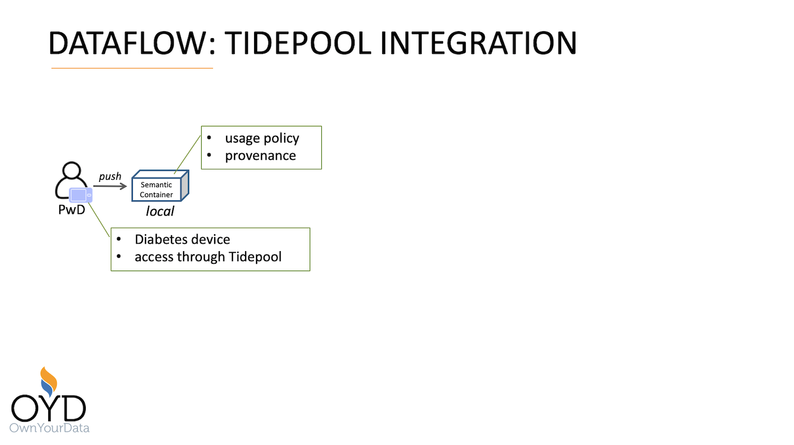

Source URL: https://github.com/sem-con/sc-diabetes/blob/master/dataflows/Tidepool_Integration/README.md    

# Dataflow: Tidepool Integration

## Introduction

The Tidepool Integration dataflow demonstrates the following capabilities:

* reading data from a Tidepool supported device
* avoding duplicates on data upload into a Semantic Container    
* providing a Diabetes specific Usage Policy    
* generating a Provenance trail specific to diabetes devices    

The figure below depicts a graphical representation of the Tidepool Integration dataflow.

<kbd></kbd>

## Stakeholders
The following stakeholders are part of the dataflow:

* **PwD** (Person with Diabetes) provides diabetes data from a Tidepool supported device in the following format:
    ```
    [
      {
        "deviceId": "DexG4Rec_SM45143452",
        "type": "cbg",
        "units": "mmol/L",
        "time": "2015-12-13T23:57:03",
        "id": "31m9q74cs8lslujphb90c6pg1u5fhatt",
        "value": 11.323525901732888
      }, { ... }
    ]
    ```


## Components    
The following components are part of the dataflow:    

* **Diabetes Device** monitors data    
    *supported devices:* https://www.tidepool.org/users/devices

* **Extraction Utility** extracts data and forwards to Semantic Container     
    *configuration:* TBD

* **Local Semantic Container of PwD** receives data from PwD          
    *configuration:* [df0_pwd_local_init.trig](df0_pwd_local_init.trig)     


## High-level Steps and Capability Demonstration

1. **Extract data from Tidepool device**    
    Link: https://github.com/MyPCH/uploader      

    The following capability is demonstrated in this step:     

	* reading data from a Tidepool supported device

2. **Semantic Container stores data**    
    A local Semantic Container stores diabetes data

    The following capabilities are demonstrated in this step:    
    * duplicates within a dataset and between datasets are identified and only first occurence is stored in the Semantic Container    
    * the Usage Policy was extended with a diabetes specific hierarchy of data categories    
    * the Provenance information holds additional data (Entity, Activity, and Agent) from the insulin monitoring device    


## Detailed Commandline Walk-through    
This section provides example commands to demonstrate the functionality described above.

1. **Extract data from Tidepool device**    
	a) configure data extraction utility... TBD

2. **Semantic Container stores data**    
    a) start local Semantic Container for PwD (*docker name: df0_pwd_local, port: 4000*)    

        SC_IMAGE=semcon/sc-diabetes:latest; \
        docker run -d --name df0_pwd_local -p 4000:3000 \
            -e IMAGE_SHA256="$(docker image ls --no-trunc -q $SC_IMAGE | cut -c8-)" \
            -e IMAGE_NAME=$SC_IMAGE \
            $SC_IMAGE /bin/init.sh "$(< df0_pwd_local_init.trig)"

    b) write diabetes data into Semantic Container    

        # dataset with data from 2018-09-07 to 2018-09-20
        cat df0_data.json | \
            curl -X POST -d @- \
                -H "Content-Type: application/json" \
                http://localhost:4000/api/data

    d) retrieve information from local Semantic Container of PwD    

        # number of records: 4031
        curl -s -H "Content-Type: application/json" \
            http://localhost:4000/api/data/plain | jq -r '. | length'


